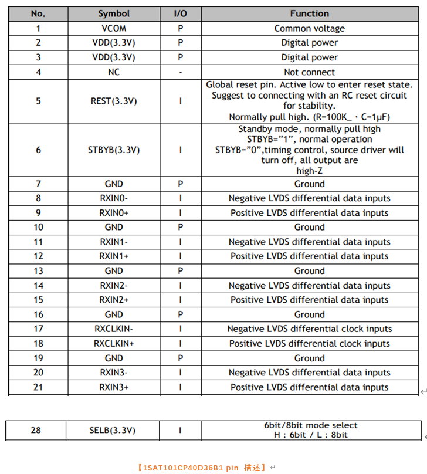

#MIPI_to_LVDS

转载 https://www.cnblogs.com/cainyu/p/15045767.html

ICN6201/02 is a bridge chip which receives MIPI® DSI inputs and sends LVDS outputs.

MIPI® DSI supports up to 4 lanes and each lane operates at 1Gbps maximum; the totally maximum input

bandwidth is 4Gbps; and the MIPI defined ULPS(ultra-low-power state) is also supported. ICN6201 decodes

MIPI® DSI 18bepp RGB666 and 24bpp RGB888 packets.

The LVDS output 18 or 24 bits pixel with 25MHz to 154MHz, by VESA or JEIDA format.

ICN6201/02 support video resolution up to FHD (1920x1080) and WUXGA (1920x1200).

ICN6201 adopts QFN48 package and ICN6202 adopts QFN40 package

## Prepare
	

	VDD 需要 3.3v 
	RST 3.3v 拉低进 rst 
	LVDS 4 组数据 差分信号，clk 一组差分信号
	SELB 决定 数据格式 6bit or 8bit 
	

	Dclk 典型值 51.2M
	H 水平方向典型值 1024
	V 垂直方向典型值 600
	H total典型值 1344 
	预分配 ：h-front-porch 160，  h-back-porch 150， h-pulse-width 10
	V total典型值 635  
	预分配 ：v-back-porch 15，    v-front-porch 15，  v-pulse-width 5

