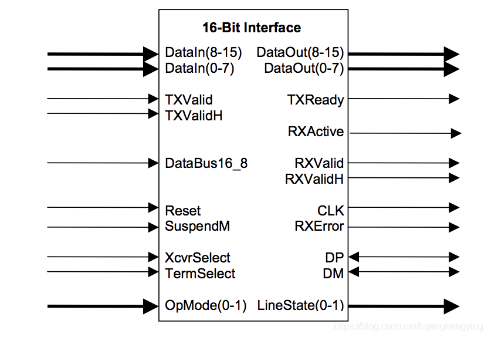

#USB

高速模块一般分为控制器Controller和PHY两部分，Controller大多为数字逻辑实现，PHY通常为模拟逻辑实现。
           USB芯片也分为Controller部分和PHY部分。Controller部分主要实现USB的协议和控制。内部逻辑主要有MAC层、CSR层和FIFO控制层，还有其他低功耗管理之类层次。MAC实现按USB协议进行数据包打包和解包，并把数据按照UTMI总线格式发送给PHY（USB3.0为PIPE）。CSR层进行寄存器控制，软件对USB芯片的控制就是通过CSR寄存器，这部分和CPU进行交互访问，主要作为Slave通过AXI或者AHB进行交互。FIFO控制层主要是和DDR进行数据交互，控制USB从DDR搬运数据的通道，主要作为Master通过AXI/AHB进行交互。PHY部分功能主要实现并转串的功能，把UTMI或者PIPE口的并行数据转换成串行数据，再通过差分数据线输出到芯片外部。
         USB芯片内部实现的功能就是接受软件的控制，进而从内存搬运数据并按照USB协议进行数据打包，并串转换后输出到芯片外部。或者从芯片外部接收差分数据信号，串并转换后进行数据解包并写到内存里。

## NRZI 

Non-Return-to-Zero,Inverted 翻转不归零码

不归零：相对于归零码（正负电平、0电平，每次编码都要回到0电平）

这种编码就是遇到逻辑0，电平才会翻转，逻辑1电平不用翻转。

RZ编码本身并不带自同步功能，USB在协议中加入了同步头（SYNC），对于每一个USB Packet，都有一个同步域固定为0000_0001，这个域翻译成NRZI编码就是01010100，接收者通过这个同步头可以算出发送者的频率。

## BIT Stuffing

位填充 

每6个连续的1之后，会强制插入一个0：避免一直发1，出现的累积误差

## ULTP

- UTMI+Low Pin Interface

- UTMI(USB2.0 Transceiver Macrocell Interface，USB2.0收发器宏单元接口)

信号 | 方向 | Desc
--- | --- | ---
CLK | IO  | 时钟输入 60MHz
DATA[7:0] | IO | 8bit双向数据总线
DIR | OUT | 控制总线方向 0 > LINK 到 PHY，1 > PHY 到 LINK
STP | IN  | Stop，停止PHY的输出，获取总线控制权，为1的时候有效
NXP | OUT | 当LINK 向PHY发送，NXT为1表示当前数据已经被PHY接受；当PHY向LINK发送，NXT为1表示PHY有新的数据在bus上

## 上面的学习目的

sdm660 如何打开第二个USB口的，dts 配置

	+++ b/kernel/msm-4.14/arch/arm64/boot/dts/qcom/sdm660-common.dtsi
	@@ -274,11 +274,11 @@
		qusb_phy0: qusb@c012000 {
			compatible = "qcom,qusb2phy";
			reg = <0x0c012000 0x180>,
	-                       <0x01fcb24c 0x4>,
	+//                     <0x01fcb24c 0x4>,
				<0x00780240 0x4>,
				<0x00188018 0x4>;
			reg-names = "qusb_phy_base",
	-                       "tcsr_clamp_dig_n_1p8",
	+//                     "tcsr_clamp_dig_n_1p8",
				"tune2_efuse_addr",
				"ref_clk_addr";
			vdd-supply = <&pm660l_l1>;
	@@ -494,7 +494,7 @@
			resets = <&clock_gcc GCC_USB_20_BCR>;
			reset-names = "core_reset";

	-               status = "disabled";
	+               status = "ok";
			dwc3@c200000 {
				compatible = "snps,dwc3";
				reg = <0x0c200000 0xc8d0>;
	@@ -531,7 +531,7 @@
			phy_type = "utmi";
			qcom,phy-clk-scheme = "cml";
			qcom,major-rev = <1>;
	-               qcom,hold-reset;
	+//             qcom,hold-reset;

			clocks = <&clock_gcc GCC_USB_PHY_CFG_AHB2PHY_CLK>,
				<&clock_gcc GCC_RX1_USB2_CLKREF_CLK>,

